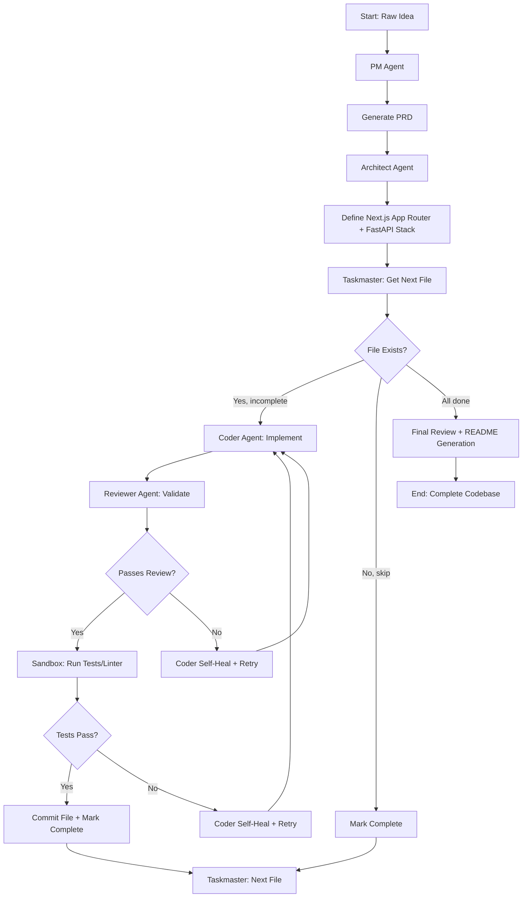

# Karkhana - Software Factory Architecture

## 1. Overview

Karkhana is a local, autonomous, multi-agent "Software Factory" that ingests raw product ideas and outputs fully functional codebases. Built with LangGraph and LM Studio (localhost:1234), it prioritizes high-fidelity execution through iterative testing and self-correction loops.

## 2. Directory Structure

```
karkhana/
├── src/
│   ├── __init__.py
│   ├── config.py                 # LM Studio, Qwen-specific settings
│   │   ├── model_name: "qwen-3-coder-next"
│   │   └── fallback_chain: []    # Single model, no fallback
│   ├── types/
│   │   ├── __init__.py
│   │   ├── state.py              # WorkingState (with progress tracking)
│   │   ├── message.py            # AgentMessage wrapper
│   │   ├── project.py            # FileTree, ComponentSpec models
│   │   └── error.py              # ErrorLog with self-healing suggestion field
│   ├── agents/
│   │   ├── __init__.py
│   │   ├── base.py               # BaseAgent class (async LLM client)
│   │   ├── pm_agent.py           # PRD generator (temperature=0.7)
│   │   ├── architect_agent.py    # Tech stack + file tree (temperature=0.5)
│   │   ├── taskmaster.py         # File queue management
│   │   ├── coder_agent.py        # Self-healing implementation
│   │   └── reviewer_agent.py     # Syntax/imports/hallucination checks
│   ├── sandbox/
│   │   ├── __init__.py
│   │   ├── executor.py           # Safe subprocess execution (no Docker)
│   │   ├── isolation.py          # Temp directory sandboxing
│   │   └── reporters.py          # Parse Python/JS error tracebacks
│   ├── graph/
│   │   ├── __init__.py
│   │   ├── flow.py               # LangGraph state machine definition
│   │   └── edges.py              # Conditional routing + self-healing logic
│   ├── utils/
│   │   ├── __init__.py
│   │   ├── prompts.py            # Qwen-optimized system/few-shot prompts
│   │   ├── parser.py             # JSON extraction from LLM outputs
│   │   └── logger.py             # Rich console progress + file logging
│   └── main.py                   # CLI entry point (rich progress bar)
├── tests/
│   ├── __init__.py
│   ├── test_agents.py
│   ├── test_sandbox.py
│   └── test_integration.py
├── examples/
│   ├── sample_idea.txt           # "Build a task manager app"
│   └── expected_output.json      # Sample file tree structure
├── .env.example                  # LM Studio config template
├── requirements.txt              # LangGraph, pydantic, openai client, rich
└── README.md
```

## 3. State Machine Flow (Mermaid)



## 4. Core Components

### 4.1 State Management (`src/types/state.py`)

The `WorkingState` class tracks:
- Raw idea / PRD
- File tree with completion status
- Current file being processed
- Error history with self-healing suggestions
- Progress metrics (files complete, LLM calls, errors encountered)
- Generation statistics

```python
class WorkingState(BaseModel):
    raw_idea: str
    prd: Optional[str] = None
    architecture: Optional[dict] = None
    file_tree: FileTree
    current_file: Optional[str] = None
    error_log: List[ErrorLog]
    progress: ProgressMetrics
```

### 4.2 Error Handling (`src/types/error.py`)

Extended `ErrorLog` model for self-healing:
```python
class ErrorLog(BaseModel):
    file_path: str
    line_number: int | None = None
    column: int | None = None
    error_type: str
    message: str
    traceback_snippet: str
    suggested_fix: str | None = None  # LLM-generated fix
```

### 4.3 LLM Integration (`src/agents/base.py`)

**Async OpenAI Client Wrapper:**
- LM Studio endpoint: `http://localhost:1234/v1`
- Model: `qwen-3-coder-next`
- Retry with exponential backoff (max 5 attempts)
- Context window management (8k tokens for Qwen)
- Token counting via tiktoken

**Configuration (`src/config.py`):**
```python
class LMStudioConfig(BaseModel):
    base_url: str = "http://localhost:1234/v1"
    model_name: str = "qwen-3-coder-next"
    temperature_pm: float = 0.7
    temperature_architect: float = 0.5
    temperature_coder: float = 0.3
    
class QwenConfig(BaseModel):
    max_context_tokens: int = 8000
    truncate_context(messages, max_tokens)
```

### 4.4 Sandbox Environment (`src/sandbox/`)

**Safe Code Execution (No Docker):**
- Temp directory isolation per file
- Process timeout enforcement (30s default)
- Resource monitoring via psutil
- Network isolation enabled

**Execution Flow:**
1. Create temp directory for build context
2. Write files to isolated environment
3. Install dependencies (pip/npx) in temp dir
4. Run linter (ruff/eslint) → Capture output
5. Run tests if present → Capture output
6. Parse error tracebacks
7. Return results + suggested fixes

**Error Reporters (`src/sandbox/reporters.py`):**
- Python traceback parser
- JavaScript/TypeScript error parser
- Extract line numbers, file paths, and error messages
- Format for LLM consumption

### 4.5 Agents (`src/agents/`)

#### PM Agent
- **Purpose:** Transform raw idea into structured PRD
- **Temperature:** 0.7 (creative but structured)
- **Output:** Valid JSON with sections:
  - Problem Statement
  - Target Users
  - Core Features
  - Technical Constraints
  - Success Metrics

#### Architect Agent
- **Purpose:** Define tech stack and file tree
- **Temperature:** 0.5 (balanced creativity/precision)
- **Tech Stack (Qwen-optimized):**
  - Frontend: Next.js App Router + TypeScript
  - Backend: FastAPI + Python 3.12+
  - Database: SQLite (simple) or PostgreSQL (production)
- **Output:** Complete file tree JSON

#### Taskmaster
- **Purpose:** Queue management and file progress tracking
- **Responsibilities:**
  - Parse architect's file tree
  - Determine next file to write
  - Track completion status
  - Report progress to CLI

#### Coder Agent
- **Purpose:** Implement individual files with self-healing
- **Temperature:** 0.3 (precise, minimal deviation)
- **Self-Healing Loop:**
  1. Generate initial implementation
  2. Reviewer validates syntax/imports
  3. Sandbox runs tests/linter
  4. If error → LLM generates fix based on traceback
  5. Retry with fixed code (max 3 attempts)
  6. On success, commit to working directory

#### Reviewer Agent
- **Purpose:** Pre-sandbox validation
- **Checks:**
  - Syntax validity (basic parsing)
  - Import resolution (exists in file tree)
  - Hallucination detection (references to non-existent modules)

## 5. LLM Prompt Engineering

### Qwen-Specific Optimizations

**System Prompt Pattern:**
```python
PM_AGENT_SYSTEM_PROMPT = """
You are an expert Product Manager. Your task is to transform raw product ideas into structured PRDs.

Guidelines:
- Use clear, concise Chinese/English bilingual output where appropriate
- Structure with numbered sections (1., 2., etc.)
- Include: Problem Statement, Target Users, Core Features, Technical Constraints
- Output valid JSON only
- Qwen-specific: You excel at technical feasibility analysis - include realistic implementation notes
"""
```

**Self-Healing Prompt:**
```
You are a Senior Developer. Your code failed the following test/linter:

[ERROR]
{error_message}

[TRACEBACK]
{traceback}

Please generate a FIXED version of {file_path} that resolves this error.
Only output the complete fixed file - no explanations.
```

### Context Window Management

**Truncation Strategy (`src/utils/prompts.py`):**
1. Keep system prompt intact
2. Preserve latest user message
3. Summarize intermediate messages if context exceeded
4. Prioritize PRD + architecture context over history

## 6. Sandbox Design Details

### Isolation (`src/sandbox/isolation.py`)
```python
async def create_isolated_context(files: dict[str, str]) -> Path:
    """Create temp directory with all files written."""
    temp_dir = tempfile.mkdtemp()
    for filepath, content in files.items():
        full_path = temp_dir / filepath
        full_path.parent.mkdir(parents=True, exist_ok=True)
        await aiofiles_write(full_path, content)
    return temp_dir
```

### Execution (`src/sandbox/executor.py`)
```python
async def run_sandbox_command(
    command: list[str],
    cwd: Path,
    timeout: int = 30
) -> SandboxResult:
    """Execute command with isolation and resource monitoring."""
    process = await asyncio.create_subprocess_exec(
        *command,
        cwd=cwd,
        stdout=asyncio.subprocess.PIPE,
        stderr=asyncio.subprocess.PIPE
    )
    
    try:
        stdout, stderr = await asyncio.wait_for(
            process.communicate(),
            timeout=timeout
        )
        return SandboxResult(
            success=process.returncode == 0,
            stdout=stdout.decode(),
            stderr=stderr.decode()
        )
    except asyncio.TimeoutError:
        process.kill()
        raise SandboxTimeout("Command exceeded timeout")
```

## 7. Implementation Order

### Phase 1: Foundation (Week 1)
1. Directory structure setup
2. `requirements.txt`, `.env.example`
3. Basic Rich logging with progress bars

### Phase 2: Core Types (Week 1-2)
4. `src/types/state.py` - WorkingState with progress tracking
5. `src/types/error.py` - ErrorLog with self-healing field
6. `src/types/message.py` - AgentMessage wrapper
7. `src/types/project.py` - FileTree, ComponentSpec models

### Phase 3: LLM Integration (Week 2)
8. `src/agents/base.py` - Async OpenAI client with retry logic
9. `src/utils/prompts.py` - Qwen-optimized system prompts
10. `src/utils/parser.py` - JSON extraction utilities
11. `src/config.py` - LM Studio configuration

### Phase 4: Sandbox Engine (Week 2-3)
12. `src/sandbox/isolation.py` - Temp directory creation
13. `src/sandbox/executor.py` - Process isolation
14. `src/sandbox/reporters.py` - Error traceback parsers

### Phase 5: Agent Implementation (Week 3-4)
15. PM Agent → PRD generation
16. Architect Agent → Tech stack + file tree
17. Taskmaster → Queue management
18. Coder Agent → Self-healing implementation
19. Reviewer Agent → Syntax/imports validation

### Phase 6: State Machine (Week 4)
20. `src/graph/edges.py` - Conditional routing logic
21. `src/graph/flow.py` - LangGraph state machine definition
22. Self-healing loop integration

### Phase 7: CLI & Polish (Week 5)
23. `src/main.py` - Rich progress bar + summary output
24. Integration tests
25. Example generation (sample_idea.txt)

## 8. Clarification Questions

Please answer the following to finalize the architecture:

1. **Database for Backend:** Should we include a default database setup?
   - SQLite for simplicity, or PostgreSQL via Docker?

2. **Authentication:** Include basic auth (JWT/session) in the generated backend, or keep it minimal?

3. **Testing Strategy:** For self-healing, should sandbox run:
   - Unit tests only?
   - Linter + type checker (mypy/pyright)?
   - Both?

4. **File Generation Order:** Should we prioritize:
   - Backend-first (API contracts before frontend)?
   - Frontend-first (UI mockup then API integration)?
   - Interleaved (alternating backend/frontend files)?

5. **Model Temperature Preferences:** Any adjustments to the suggested temperatures?
   - PM Agent: 0.7
   - Architect: 0.5
   - Coder: 0.3

6. **Error Retry Limits:** How many self-healing attempts before giving up?
   - Current suggestion: Max 3 retries per file

7. **Output Scope:** Should generated projects include:
   - GitHub Actions workflows (`.github/workflows/ci.yml`)?
   - `.gitignore` (Python + Node.js patterns)?
   - `README.md` with setup instructions?
   - `Dockerfile` and `docker-compose.yml`?

8. **Progress Tracking:** Any specific metrics or visualizations you'd like in the CLI summary?

---

## 9. Finalized Configuration (Based on User Answers)

### A. Database: SQLite
- Lightweight, file-based database
- Zero configuration required
- Perfect for local development and small-to-medium applications

**Architect Agent Output Example (with SQLite):**
```json
{
  "backend": {
    "framework": "fastapi",
    "python_version": "3.12+",
    "database": "sqlite",
    "dependencies": ["fastapi", "uvicorn[standard]", "sqlalchemy", "pydantic", "aiosqlite"],
    "file_structure": {
      "app/": ["main.py", "routes/", "models/", "schemas/", "db.py", "deps.py"],
      "tests/": ["test_api.py"]
    }
  }
}
```

### B. Authentication: JWT/session auth
- Full authentication system included
- JWT tokens for API endpoints
- Session-based auth for web interface
- Password hashing with bcrypt
- User registration/login flows

**Backend Includes:**
- `/api/auth/register` - User registration
- `/api/auth/login` - JWT token generation
- `/api/auth/me` - Current user endpoint
- `app/models/user.py` - SQLAlchemy User model
- `app/schemas/user.py` - Pydantic schemas
- `app/core/security.py` - Password hashing, token utilities

### C. Testing Strategy: Both linter + type checker
- **Linter:** Ruff (Python), ESLint (JavaScript)
- **Type Checker:** MyPy (Python), TypeScript compiler (JavaScript)
- **Format Validation:** Black (Python), Prettier (JavaScript)
- Full error reporting for all checkers

**Sandbox Execution Flow:**
```
1. Write files to isolated temp directory
2. Install dependencies (pip install -r requirements.txt, npm install)
3. Run Ruff → Check style/syntax errors
4. Run MyPy → Check type annotations
5. Run ESLint → JavaScript linting
6. Run TypeScript compiler → Type check JS/TS
7. Parse all error outputs → Feed to Coder Agent if failures
```

### D. File Generation Order: Interleaved
- Alternates between backend and frontend files
- Ensures API contracts are aligned with UI components
- Prevents bottlenecks in single-stack development

**Generation Pattern:**
```
1. app/main.py (backend entry point)
2. app/page.tsx (frontend entry point)
3. app/api/route.py (backend API route)
4. app/components/Header.tsx (frontend component)
5. app/models/user.py (backend model)
6. app/lib/axios.ts (frontend HTTP client)
... and so on
```

### E. Model Temperatures: Keep as-is
- **PM Agent:** 0.7 (balanced creativity/structure)
- **Architect:** 0.5 (precise technical decisions)
- **Coder:** 0.3 (deterministic implementation)

### F. Self-Healing Retry Limit: 3 attempts
- First failure → Generate fix, retry
- Second failure → Generate improved fix, retry
- Third failure → Mark as complete with error notes, continue to next file
- Error logged in `error_log` with suggested fix for manual review

**Self-Healing Prompt (Coder Agent):**
```
You are a Senior Developer. Your code failed the following test/linter:

[ERROR]
{error_message}

[TRACEBACK]
{traceback}

Please generate a FIXED version of {file_path} that resolves this error.
Only output the complete fixed file - no explanations.

Previous attempts:
Attempt 1: [failed fix attempt 1]
Attempt 2: [failed fix attempt 2]

Now generate Attempt 3 with improved logic.
```

### G. Output Scope: Full suite (all files)
Generated projects will include:

**Configuration Files:**
- `.env.example` - Environment variables template
- `.gitignore` - Python + Node.js patterns
- `pyproject.toml` / `package.json` - Dependencies

**Documentation:**
- `README.md` - Setup instructions, usage guide
- `CONTRIBUTING.md` - Development guidelines (optional)

**CI/CD:**
- `.github/workflows/ci.yml` - GitHub Actions workflow
  - Run linters on push
  - Execute tests on pull requests

**Docker Support:**
- `Dockerfile` - Production container image
- `docker-compose.yml` - Local development environment
  - Includes database service (SQLite volume mount)

**Code Quality:**
- `ruff.toml` - Ruff configuration
- `.eslintrc.json` - ESLint configuration
- `.prettierrc` - Code formatting rules

### H. Progress Tracking Metrics

**Rich Console Output:**
```
[00:00] 🏗️  Initializing Software Factory...
[00:02] ✅ PRD Generated (256 tokens)
[00:05] ✅ Architecture Defined (Next.js App Router + FastAPI)
[00:10] 📋 Queueing 27 files...

┌─────────────┬───────────────┬────────────┐
│ File        │ Status        │ Time       │
├─────────────┼───────────────┼────────────┤
│ app/page.py │ ✅ Complete   │ 4.2s       │
│ app/api.py  │ ⏳ In Progress│ -          │
└─────────────┴───────────────┴────────────┘

[05:32] 🎉 Build Complete!
```

**Summary Output:**
```
┌────────────────────────────────────┐
│        BUILD STATISTICS            │
├────────────────────────────────────┤
│ Total Files Generated: 27         │
│ Python Files (FastAPI): 14        │
│ JavaScript Files (Next.js): 8     │
│ Config Files: 5                   │
│ Total Generation Time: 5m 32s     │
│ LLM Calls: 42                     │
│ Errors Encountered: 3             │
│ Self-Healing Attempts: 2          │
│ Database: SQLite                  │
│ Auth: JWT/Session                 │
└────────────────────────────────────┘
```

---

## Final Architecture Complete

Ready to proceed with implementation!
