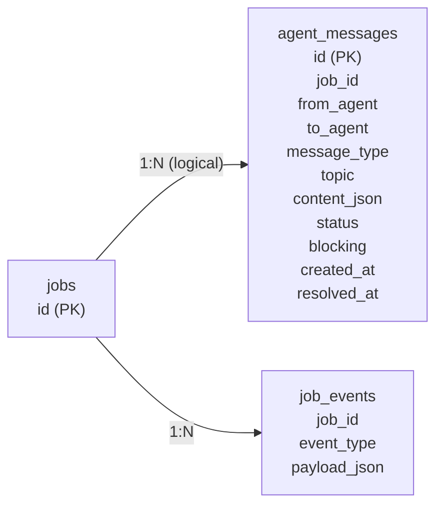

# Week 1 Handoff: Agent Comms Foundation

Date: 2026-03-01

## Completed Scope

- Added typed inter-agent protocol models (`AgentMessage`, request DTOs, decision DTOs).
- Added persistent `agent_messages` table and indexes in SQLite initialization.
- Added repository CRUD for create/list/resolve agent messages.
- Added `WorkingState` fields required for future coordination runtime wiring.
- Added read-only and manual resolve APIs under Command Center.
- Added normalized WebSocket event helper and schema for:
  - `agent_message_created`
  - `agent_message_resolved`
  - `agent_message_escalated`
- Added Week 2 TODO markers in graph and agent modules for runtime wiring boundaries.
- Added test suite for Week 1 contracts and regressions.

## Migration Diff (Exact SQL Added)

```sql
CREATE TABLE IF NOT EXISTS agent_messages (
    id INTEGER PRIMARY KEY AUTOINCREMENT,
    job_id TEXT NOT NULL,
    from_agent TEXT NOT NULL,
    to_agent TEXT NOT NULL,
    message_type TEXT NOT NULL,
    topic TEXT NOT NULL,
    content_json TEXT NOT NULL,
    status TEXT NOT NULL DEFAULT 'pending',
    blocking INTEGER NOT NULL DEFAULT 0,
    created_at REAL NOT NULL,
    resolved_at REAL
);

CREATE INDEX IF NOT EXISTS idx_agent_messages_job_created
    ON agent_messages(job_id, created_at ASC);
CREATE INDEX IF NOT EXISTS idx_agent_messages_job_status
    ON agent_messages(job_id, status);
```

Migration characteristics:

- Idempotent: safe to run repeatedly via `init_db()`.
- Backward compatible: no changes to existing tables/endpoints.

## Entity Model Diagram



## Endpoint Examples

### List All Messages

`GET /api/command-center/jobs/{job_id}/agent-messages`

```json
[
  {
    "id": 7,
    "job_id": "88f32b0f7b59",
    "from_agent": "coder_agent",
    "to_agent": "pm_agent",
    "message_type": "clarification_request",
    "topic": "timezone_handling",
    "content_json": {"question": "Should we store UTC only?"},
    "status": "pending",
    "blocking": true,
    "created_at": 1740787500.12,
    "resolved_at": null
  }
]
```

### List Pending Messages

`GET /api/command-center/jobs/{job_id}/agent-messages/pending`

```json
[
  {
    "id": 7,
    "status": "pending"
  }
]
```

### Resolve Message Manually

`POST /api/command-center/jobs/{job_id}/agent-messages/{message_id}/resolve`

Request:

```json
{
  "decision": {
    "status": "approved",
    "rationale": "Proceed with UTC-only persistence.",
    "metadata": {"manual": true}
  }
}
```

Response:

```json
{
  "ok": true,
  "message": {
    "id": 7,
    "status": "resolved",
    "resolved_at": 1740787512.44
  }
}
```

## WebSocket Event Example

Event type: `agent_message_resolved`

```json
{
  "type": "agent_message_resolved",
  "job_id": "88f32b0f7b59",
  "payload": {
    "job_id": "88f32b0f7b59",
    "message_id": 7,
    "from_agent": "reviewer_agent",
    "to_agent": "architect_agent",
    "message_type": "dependency_approval_request",
    "topic": "sqlite_migration_tool",
    "blocking": true,
    "status": "resolved",
    "created_at": 1740787500.12,
    "resolved_at": 1740787512.44,
    "content_json": {
      "dependency": "alembic",
      "decision": {"status": "approved", "rationale": "Allowed"}
    }
  },
  "timestamp": 1740787512.45
}
```

## Test Report

Command:

```bash
.venv/Scripts/python -m pytest -q
```

Result:

- `10 passed` in ~2.4s.
- Coverage includes:
  - DTO schema validation.
  - Migration idempotence.
  - Repository create/list/resolve behavior.
  - API integration for list/pending/resolve.
  - 404 contract checks for unknown `job_id`.
  - WebSocket event replay contains `agent_message_resolved`.
  - Regression checks for existing job APIs and legacy event shape.

## Runtime Wiring TODO Markers (for Week 2)

- `src/graph/flow.py`
  - `TODO(agent-comms-w2): route through agent coordinator/resolution nodes before architect and coder stages.`
  - `TODO(agent-comms-w2): allow reviewer outcomes to trigger agent comm escalation path before retry/continue.`
- `src/agents/coder_agent.py`
  - `TODO(agent-comms-w2): emit structured clarification/dependency requests when requirements are ambiguous.`
- `src/agents/reviewer_agent.py`
  - `TODO(agent-comms-w2): emit feature/dependency risk requests when review finds policy mismatches.`
- `src/agents/architect_agent.py`
  - `TODO(agent-comms-w2): resolve incoming dependency approval requests from other agents.`
- `src/agents/taskmaster.py`
  - `TODO(agent-comms-w2): raise sequencing/decomposition clarification requests when file order is ambiguous.`

## Notes for Week 2 Agent

- Feature flag foundation is present with `AGENT_COMMS_ENABLED=false` default in config/env.
- Runtime graph behavior is unchanged in Week 1 by design.
- Recommended next step: implement coordinator/resolution/escalation graph nodes and route gates behind `AGENT_COMMS_ENABLED`.
