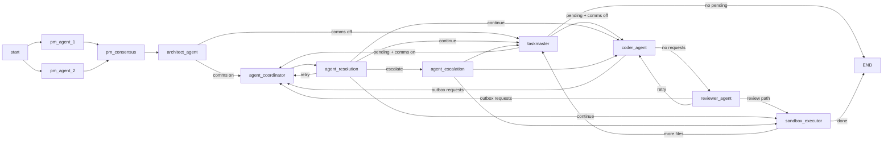

# Week 2 Handoff: Runtime Agent Coordination

Date: 2026-03-01

## Completed Scope

- Added runtime coordination in graph with three nodes:
  - `agent_coordinator_node`
  - `agent_resolution_node`
  - `agent_escalation_node`
- Routed coordination:
  - after `architect_agent`
  - before `coder_agent` (from `taskmaster`)
  - after `reviewer_agent` when reviewer emits requests
- Added request routing rules, dedupe, round budget enforcement, and escalation policy.
- Added runtime service contract support:
  - `create_agent_message(..., round_number=...)`
  - `resolve_agent_message(..., round_number=...)`
  - `escalate_agent_message(..., round_number=...)`
- Added feature flags:
  - `AGENT_COMMS_ENABLED`
  - `AGENT_COMMS_MAX_ROUNDS`
  - `AGENT_COMMS_ESCALATE_BLOCKING_ONLY`
- Added structured request emitters in:
  - `CoderAgent`
  - `ReviewerAgent`
  - `ArchitectAgent`
  - `Taskmaster`
- Added tested helper module:
  - `src/graph/agent_comms.py`

## Migration Notes

Database migrations: **none in Week 2** (Week 1 schema reused).

Config/env changes:

- `src/config.py`: `AgentCommsConfig.max_rounds`, `AgentCommsConfig.escalate_blocking_only`.
- `.env.example`: added `AGENT_COMMS_MAX_ROUNDS`, `AGENT_COMMS_ESCALATE_BLOCKING_ONLY`.

State schema changes:

- `src/types/state.py`:
  - added `agent_comms_enabled`
  - added `agent_comms_escalate_blocking_only`
  - added `coordination_origin`
  - added `coordination_action`
  - added `review_passed`, `review_issues`
  - changed `prd_drafts` to reducer-backed list for parallel PM branch safety

## Active Graph Diagram



## Event Catalog (Week 2)

### `agent_message_created`

```json
{
  "type": "agent_message_created",
  "payload": {
    "job_id": "job-123",
    "message_id": 41,
    "from_agent": "coder_agent",
    "to_agent": "pm_agent",
    "message_type": "clarification_request",
    "topic": "requirements_scope",
    "blocking": true,
    "round": 1,
    "status": "pending",
    "created_at": 1740789000.1,
    "resolved_at": null,
    "content_json": {"area": "requirements", "question": "Clarify scope"}
  }
}
```

### `agent_message_resolved`

```json
{
  "type": "agent_message_resolved",
  "payload": {
    "job_id": "job-123",
    "message_id": 41,
    "from_agent": "coder_agent",
    "to_agent": "pm_agent",
    "message_type": "clarification_request",
    "topic": "requirements_scope",
    "blocking": true,
    "round": 1,
    "status": "resolved",
    "created_at": 1740789000.1,
    "resolved_at": 1740789001.4,
    "content_json": {
      "area": "requirements",
      "question": "Clarify scope",
      "decision": {"status": "approved", "rationale": "PM clarified requirements scope."}
    }
  }
}
```

### `agent_message_escalated`

```json
{
  "type": "agent_message_escalated",
  "payload": {
    "job_id": "job-123",
    "message_id": 42,
    "from_agent": "architect_agent",
    "to_agent": "pm_agent",
    "message_type": "clarification_request",
    "topic": "unresolved_blocking_case",
    "blocking": true,
    "round": 1,
    "status": "escalated",
    "escalation_reason": "Blocking unresolved requests with exhausted coordination budget.",
    "created_at": 1740789010.2,
    "resolved_at": 1740789012.5,
    "content_json": {
      "area": "requirements",
      "force_unresolved": true,
      "decision": {"status": "escalated", "rationale": "Blocking unresolved requests with exhausted coordination budget."}
    }
  }
}
```

## Benchmark: Added Coordination Overhead

Method:

- Patched deterministic agent methods (no external LLM/network).
- Same one-file workflow shape.
- Compared `AGENT_COMMS_ENABLED=false` vs `true`.
- 5 runs each mode.

Results:

- Comms disabled:
  - avg runtime: `2.4096s`
  - avg `llm_calls_count`: `5`
  - avg coordination rounds: `0`
- Comms enabled (one coder clarification round):
  - avg runtime: `3.5820s`
  - avg `llm_calls_count`: `5`
  - avg coordination rounds: `1`

Interpretation:

- Runtime overhead for one coordination round was ~`1.17s` in this local synthetic run.
- LLM call count did not increase in this deterministic benchmark because resolution handlers were rule-based.

## Test Report

Command:

```bash
.venv/Scripts/python -m pytest -q
```

Result:

- `19 passed`.
- Week 2 specific coverage:
  - router target selection
  - dedupe behavior
  - budget exhaustion to escalation action
  - coder clarification -> PM resolve -> resume
  - dependency request -> rejection -> dependency-avoiding generation
  - reviewer mismatch -> PM clarification -> retry pass
  - blocking unresolved escalation path
  - non-blocking unresolved warning/proceed path
  - comms-disabled regression behavior

## Known UX Gaps (for Week 3)

- Command Center frontend does not yet show an Agent Comms timeline/tab.
- Escalated messages are persisted/events emitted, but no dedicated UI queue/controls yet.
- No UI counters for unresolved/escalated requests.
- No restart-thread rehydration UI for comms yet.
